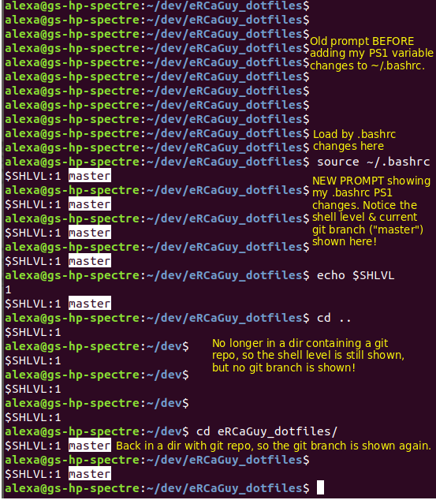

Gabriel Staples

This project is well-maintained, highly-used by myself, and highly-functional. It's not experimental, it's what I use every day. Feel free to use or borrow from it yourself. 

# Project: eRCaGuy_dotfiles
https://github.com/ElectricRCAircraftGuy/eRCaGuy_dotfiles

# Description of contents
This project started out as just a few helpful nuggets I like to put in my `~/.bashrc` file, for example, as well as some scripts and other configuration files, but I decided to make it a place I put all sorts of reference scripts, files, shortcuts, Linux tips & tricks, Eclipse documentation, etc, I've built up over the years. 

## Here's some of the contents contained herein:
1. `git diffn` drop-in-replacement program to show `git diff` with line 'n'umbers. As a thin `awk`-language-based wrapper around `git diff` it supports ALL options and features that `git diff` does! Screenshot:
    1. 
1. .bashrc file which contains:
    1. `ls` aliases such as `ll`, `la`, & `l`
    1. Prompt String 1 (`PS1`) modifications to add terminal titles, current git branch name checked out [VERY USEFUL FEATURE!], bash shell level, etc
        1. 
    1. ssh alias
    1. function to set terminal title
    1. ability to open up default tabs (with unique titles) for rapid launching of tabs in a terminal for development work
1. .gitconfig file with meld as my difftool, `git lg` alias, etc
1. Preferences.sublime-settings = Sublime Text 3 settings I like
1. .gitignore example
1. .imwheelrc config to improve mouse wheel scroll speed in Chrome
1. Templates for right-click --> Create New Document menu in GUI file manager
1. Desktop launchers (.desktop) files, including install/uninstall scripts
1. Arduino tools & resources
    1. How to enable uploading to boards by adding user to "dialout" group
    1. How to enable flashing bootloaders with USBasp tool by setting up proper udev rule
1. Eclipse tools & resources, including a reference & setup manual I've written:
    1. Eclipse setup instructions on a new Linux (or other OS) computer.pdf
    1. Eclipse color theme to make it have syntax highlighting that looks exactly like Sublime Text 3 (thanks to Jeremy Shepherd!)
1. /etc/udev/rules.d/ udev rules
1. NoMachine remote login setup info
1. Useful scripts: see [section below](#useful-scripts)
1. etc.

# Installation & Usage:

    ./install_all.sh

You can run the main installation script for this **eRCaGuy_dotfiles** project like this: `./install_all.sh`. Edit this script first if customization is desired. It's all interactive, however, so it won't overwrite anything without your permission. 

_However, it's still a good idea to back up your home directory first before running the installation script and to: 1) read the installation prompts carefully as it asks you to for permission to overwrite something, and 2) make sure you back any of those files it's prompting you about before allowing it to overwrite them._

**Additionally:**  

1. Most files contain comments with additional info, instructions, or helpful links to look at.
2. Many directories contain readmes, and some contain install scripts, such as my scripts to help install **.desktop** files. 
3. If a readme exists in a subfolder, take a look at it too for more install help or other usage information. 
4. Essentially, just read the readmes, headers, & other comments and it will become self-explanatory how to use or "install" something. If not, open up an issue or pull request and I'll address it. 

# Useful Scripts 
## See [useful_scripts/README.md](https://github.com/ElectricRCAircraftGuy/eRCaGuy_dotfiles/tree/master/useful_scripts#ercaguy_dotfilesuseful_scripts)

Here is a list of all of the scripts provided in the "useful_scripts" directory. Some of these are so amazingly useful to me, and powerful, they deserve a section all on their own! 

**Therefore, I have created an additional readme to describe a few of these scripts in greater detail here: [useful_scripts/README.md](https://github.com/ElectricRCAircraftGuy/eRCaGuy_dotfiles/tree/master/useful_scripts#ercaguy_dotfilesuseful_scripts).**

(tree generated w/`tree eRCaGuy_dotfiles/useful_scripts`):

Select scripts which I find especially useful are **marked with up to 5 asterisks (\*\*\*\*\*):**

    $ tree useful_scripts/
    useful_scripts/
    ├── apt-cacher-server_proxy.sh
    ├── apt-cacher-server_proxy_status.sh
    ├── apt-cacher-server_proxy_toggle.sh
    ├── desktop_file_install.sh -> ../Desktop_launchers/desktop_file_install.sh
    ├── desktop_file_uninstall.sh -> ../Desktop_launchers/desktop_file_uninstall.sh
    ├── *****find_and_replace.sh
    ├── find_and_replace_test_folder
    │   ├── readme.md
    │   ├── test1.cpp
    │   ├── test1.txt
    │   ├── test2.cpp
    │   ├── test2.txt
    │   └── test3.txt
    ├── *****git-changes.sh
    ├── git-diffc.sh
    ├── git-diffn_screenshot_cropped.png
    ├── git-diffn_screenshot.png
    ├── *****git-diffn.sh
    ├── *****git-filechange-search.sh
    ├── git-tree.txt
    ├── install_all.sh -> ../install_all.sh
    ├── Link to ElectricRCAircraftGuy - Chrome-Case-Sensitive-Find A case-sensitive Find tool (recommended to use Ctrl + Alt + F) for the Google Chrome Browser.desktop
    ├── Link to ElectricRCAircraftGuy - eRCaGuy_PyTerm A datalogging serial terminal-console written in Python (I hope to extend it to Telnet and others later).desktop
    ├── Link to ElectricRCAircraftGuy - git-tree New git features 1) graphically view all your branches in a hierarchical fashion based on forking or desired dependencies; 2) cascade recursive rebases down the line.desktop
    ├── Link to ElectricRCAircraftGuy - PDF2SearchablePDF `pdf2searchablepdf input.pdf` = voila! ''input_searchable.pdf'' is created & now has searchable text!.desktop
    ├── *****open_programming_tools.sh
    ├── README_git-diffn.md
    ├── README_git-sync_repo_from_pc1_to_pc2.md
    ├── README.md
    ├── ****ros_readbagfile.py
    ├── scratch_work
    │   └── gawk_git_diff_with_line_numbers.sh
    ├── sync_git_repo_from_pc1_to_pc2--notes.txt
    ├── *****sync_git_repo_from_pc1_to_pc2.sh
    ├── *****tmux-session.sh
    └── *****touchpad_toggle.sh

    2 directories, 34 files
